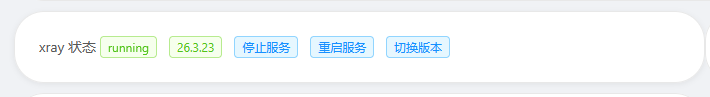

# 自己搭建vpn

## 下载x-ui

bash <(curl -Ls https://raw.githubusercontent.com/franzkafkayu/x-ui/master/install.sh)


## 使用ipv4进行转发

```bash
sysctl -w net.ipv4.ip_forward=1
```


## 更新xray


去ui面板更新到一个比较新的xray




## 配置reality伪装并配置端口（记得打开端口），目标网站找一个能curl通的，端口不要选443


##  打开云服务器防火墙和Linux端口

```bash
ufw allow 56789/tcp
```

## 复制链接


## 这个链接是v2ray的，去转换为clash

转换：[Subconverter Web - 在线订阅转换](https://sub.asailor.org/)


## 购买国家域名

https://www.namesilo.com/

## 改为cloudflare托管dns

[Cloudflare Dashboard | Manage Your Account](https://dash.cloudflare.com/90a53a053b4c1fb2f8051c2ae0be3029/add-site)

输入买的域名，获取新的dns


然后回到https://www.namesilo.com/account_domains.php


把cloudflare的dns填到namesoil中


## 配置cloudflare解析主机，需要几分钟

==只保持一条记录==


## 配置CDN专用代理


## VLess配置

v2ray下载：[Files Download](https://v2rayn.2dust.link/)


## 后续更换搬瓦工服务器

只需要去cloudflare的dns解析哪里把xiancn.top改成新的节点即可。如果想让用户uuid不变，那些入参都要是原来的


## 最好的解决方案

开两个端口，一个用reality直连，等vultr的ip被封了，就用cloudflare的